# Computer System Architecture Course Project

Primus
---


目录

1. 操作说明
2. 数据结构
3. 文件结构
4. 拓展功能和必要说明

## 1. 操作说明

本文档用于期末作业的操作以及完成细节的说明。

### 界面

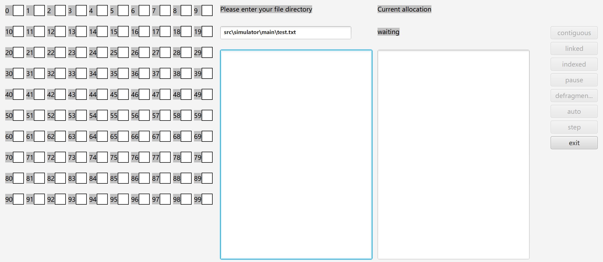

### 说明

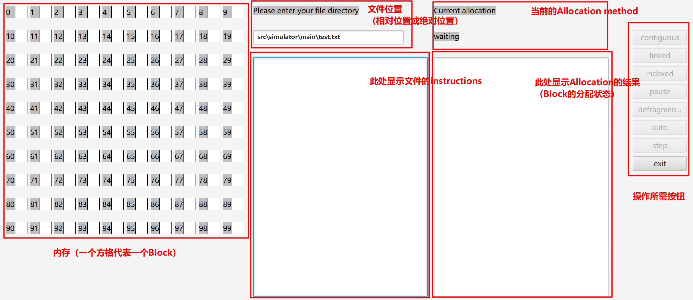

界面包括六部分内容，包括内存，文件位置，内存分配方式，文件中的指令，指令对应的分配状态，操作所需按钮。

### 操作

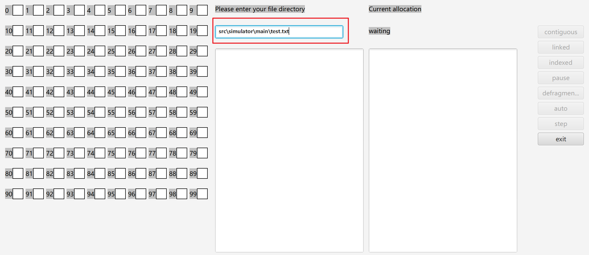

1. 在文件位置区域输入.txt文件所在绝对地址或相对地址（相对地址匹配难度较大，建议使用绝对地址），默认为src\simulator\main文件夹中的"test.txt"文件（**具体指令格式请参考该文件，最大内存为100 blocks**）。

   输入完成后敲击回车键，读取指令。

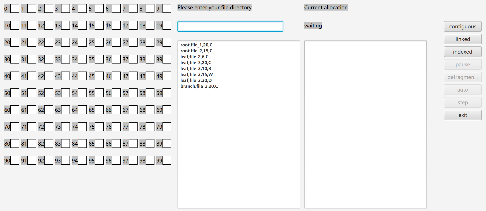

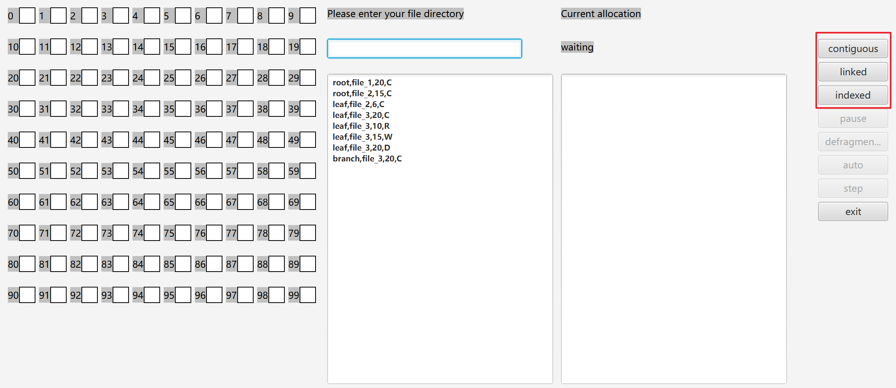

2. 选择三种内存分配方式的一种，单击该按钮。分配方式区域相应改变（以indexed为例）。

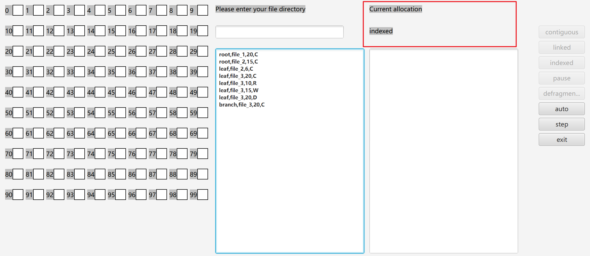

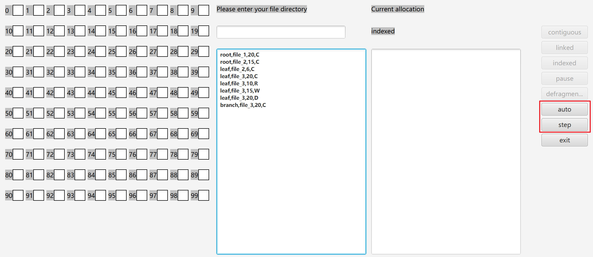

3. 单击auto自动执行指令，或单击step按钮手动执行指令。

   单击step后可单击auto自动执行；

   单击auto后pause按钮可用，用于暂停自动执行过程，随后可单击step手动执行，或单击auto继续自动执行；

   执行完毕后，auto, step, pause均不可用，defragmentation可用。

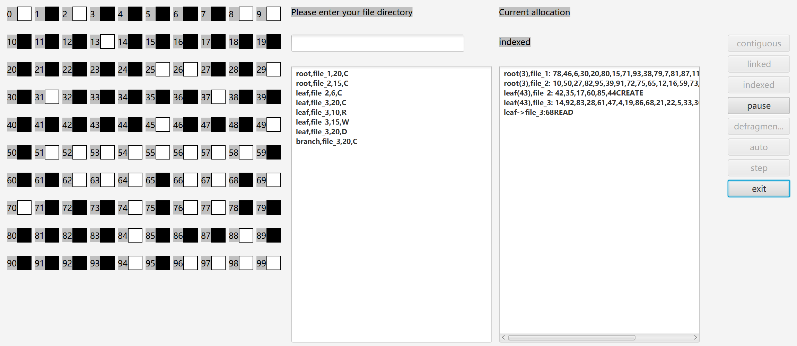

（执行过程中）

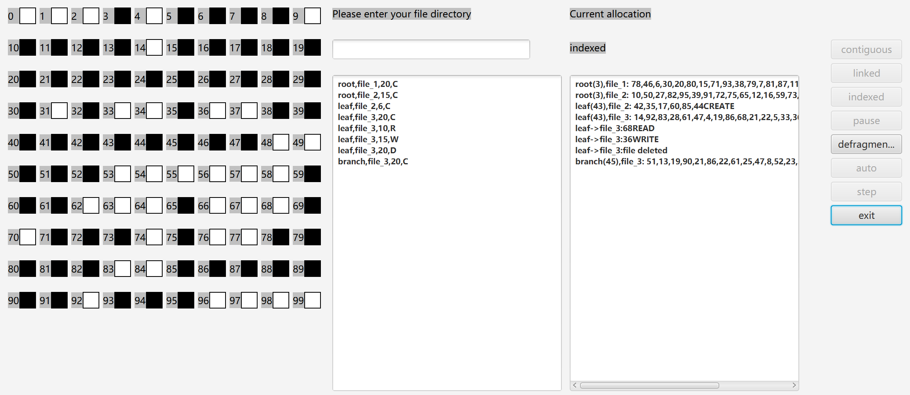

（执行结束后）

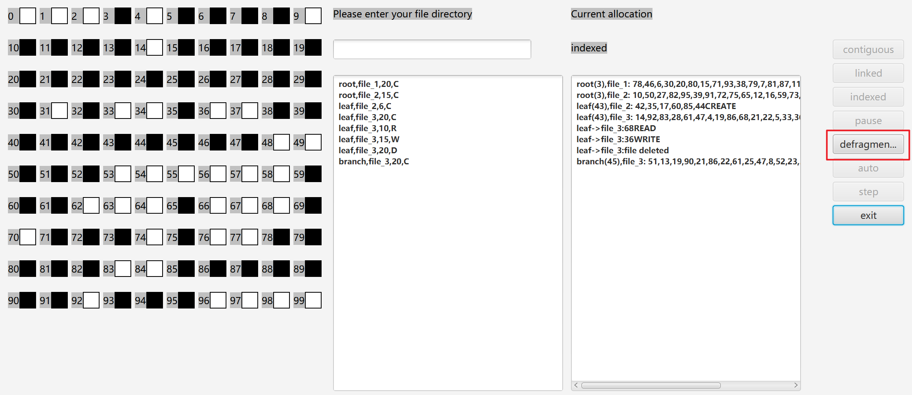

4. 当defragmentation可用时，单击该按钮，可自动执行去碎片化操作。

   任意时刻，单击exit按钮可退出该系统。

## 2. 数据结构

### Block

本系统使用javafx进行编写，内存的基本组成单元为Block类，包含私有变量如下：

```java
    private Block directory;        // file directory
    private Block nextBlock;        // next block in logic address
    private Block lastBlock;        // last block in logic address
    private String fileName;        // file name
    private int myLine;             // block line
    private int myRow;              // block row
    private int fileLength;         // file length
    private int blockNumber;        // position in file
    private boolean occupied;       // whether occupied
    private boolean isDirectory;    // whether directory
```

Block 包含内存在不同分配方式下的逻辑地址信息。

### Table

Table类为内存的操作对象，私有变量如下：

```java
    private Block[][] table;            // information stores in block
    private int line;                   // overall maximum line of space
    private int row;                    // overall maximum row of space
```

Table 包含内存的物理地址信息，以二维数组的形式储存Block。

### Method

Method类为内存的操作主体（，私有变量如下：

```java
    protected int line;
    protected int row;
    protected Pane root;
    protected Rectangle[][] rtgs;
    protected String[][] instrTable;
    protected TextArea instructions;
    protected TextArea fileInfo;
    protected Table table;
    protected int instrNo;
```

对应系统界面的各控件以及关键数据结构，包括Table类和系统的内存大小(line*row)。

## 3. 文件结构

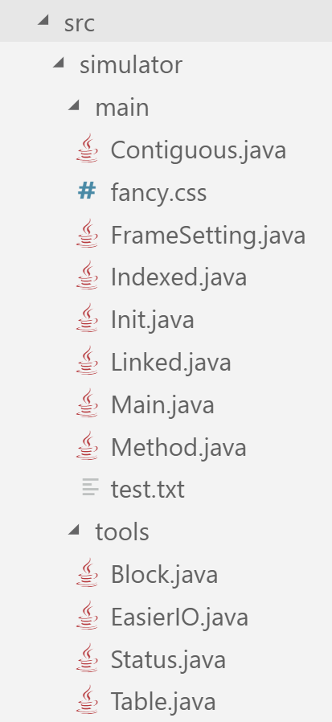

### Main类

继承javafx的Application类，为系统主程序。

### Init, FrameSetting类

为提高Main.start()函数的代码可读性和可操作性，将大部分设置控件的代码放入Init类，将大部分设置监听器的代码放入FrameSetting类。

### fancy.css

控制控件外观。

### text.txt

默认位置的测试文件。

### Method类(Contiguous, Linked, Indexed)

三种方法继承自抽象类Method，包含对Table的不同操作，用于内存分配。

### Block, Table类

基本数据结构，见2.

### Status类

用于协调控件和监听线程之间，表示系统目前的内存分配方式(WAITING, CONTIGUOUS, LINKED, INDEXED)。

### EasierIO类

用于读取文件中的指令。

## 4. 拓展功能和必要说明

### 输入指令的文件内容

实例：test.txt

root,file_1,20,C
leaf,file_2,6,C
leaf,file_1,10,R
leaf,file_3,15,W
leaf,file_3,20,D
branch,file_3,20,C

(.txt文件结束处建议不加回车)

### 去碎片化

指令执行完毕时，单击defragmentation，系统将由第一个fragmentation开始，将所有的空余Block通过swap方式放置于内存较高位的位置，同时将已占有的Block放置于低位。

### 多重路径

对于多重路径，系统记录每一个Block的directory；当试图执行Delete操作时，系统检查是否为directory；若是，检查文件夹是否为空；仅当directory为空时才能够删除该directory。

